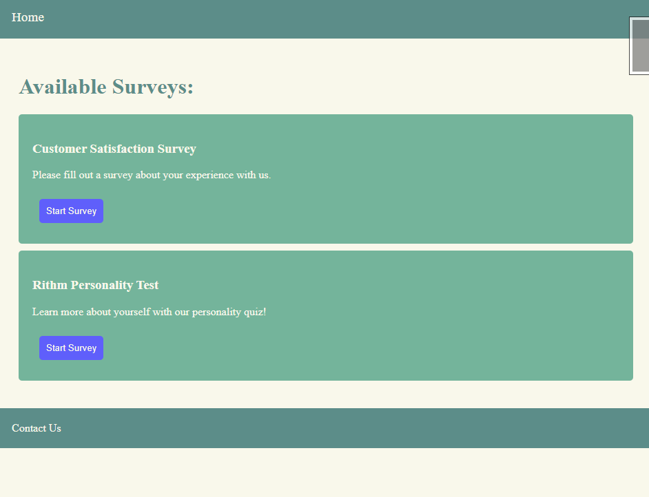

# surveys
A simple survey made with flask, CSS and HTML


<!-- ABOUT THE PROJECT -->
## About The Project
This is a simple survey built with Flask, HTML and CSS.

### surveys.py
contains two classes Question and Survey which are used to build a structure of survey instances. 
Two survey instances are included in a surveys dictionary, which has been imported to app.py 

### app.py
required imports
```Python 
from flask import Flask, render_template, redirect, flash, request, session
import surveys
from flask_debugtoolbar import DebugToolbarExtension
```
DebugToolbarExtension is used for debugging. 

**Routes:**
```Python
# home page
@app.route("/")

# starting a new survey
@app.route("/new_survey", methods=['POST'])

# checking if user has correct question
@app.route('/check-question')

# rendering the current survey question
@app.route("/question/<int:question_number>")

# recording answer in flask session and checking if current question is the last question
@app.route("/record-answer", methods=["POST"])

# displaying survey completion page
@app.route("/thanks")
```

### HTML pages
- base.html - *contains navbar, footer and error messages that can be extended to other pages using jinja templating*
- complete.html - *displays the survey has been completed message*
- index.html - *main page that displays available surveys*
- questions.html - *shows current question which id rendered dynamically based on user progress with current survey*
- thanks.html - *survey completion page that shows summary of user answers*
